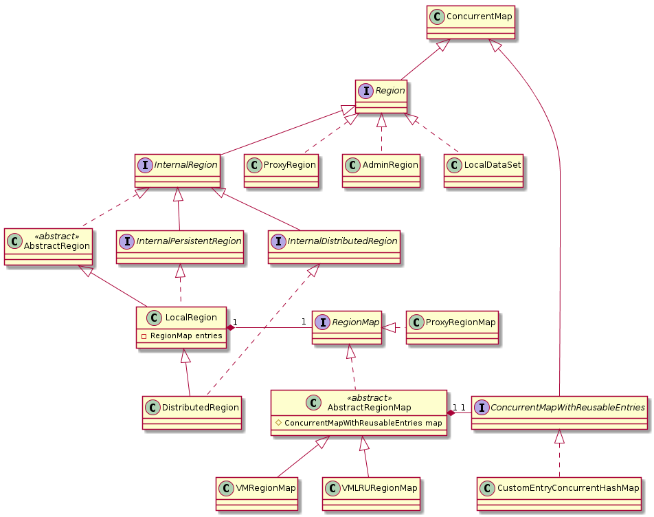
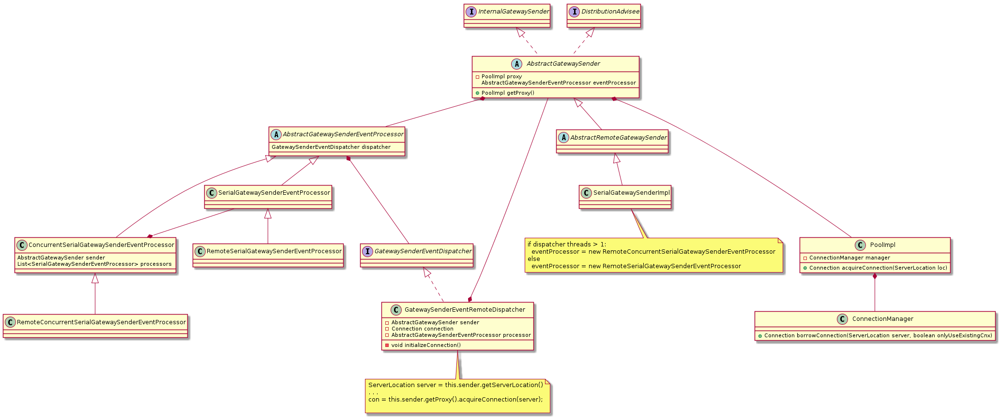

# geode-uml
Some PlantUML diagrams I implemented to get familiar with Apache Geode code

They are not 100% complete (not even close!), I just wanted to have a picture of the minimun elements I considered interesting.

# Regions

# DiskStore

# Statistics

# Cache

# Gateway Senders

